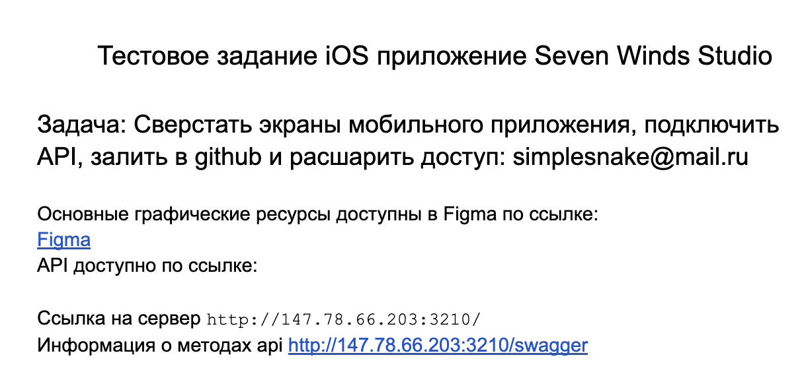
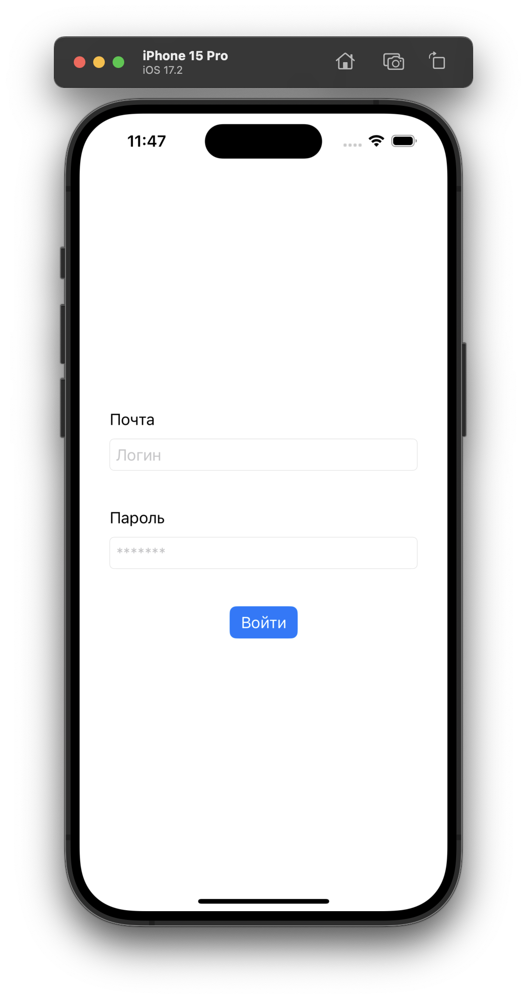
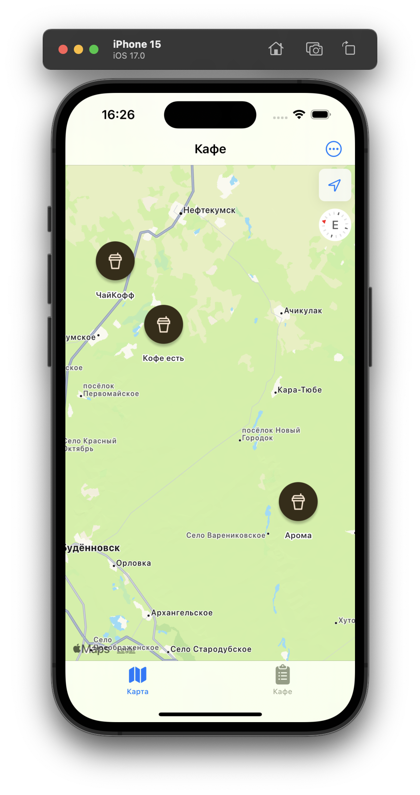
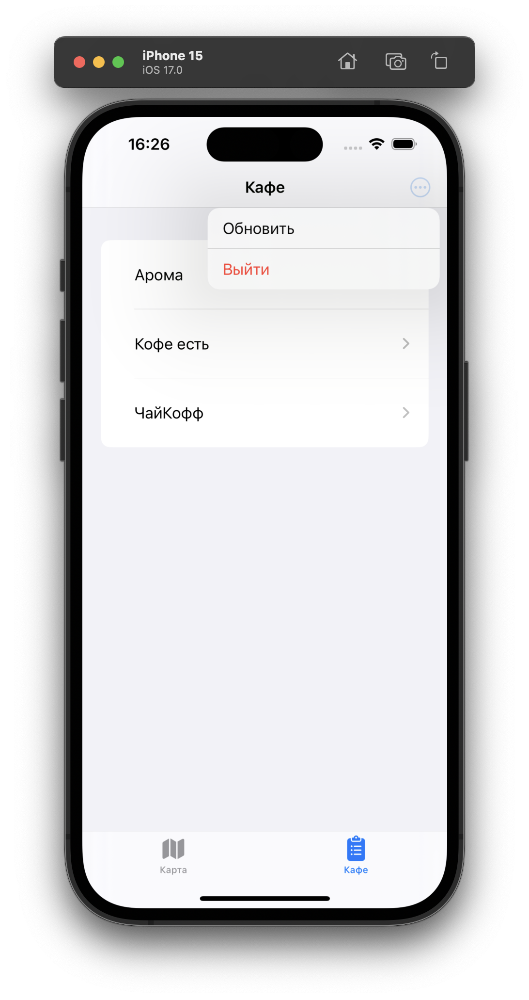
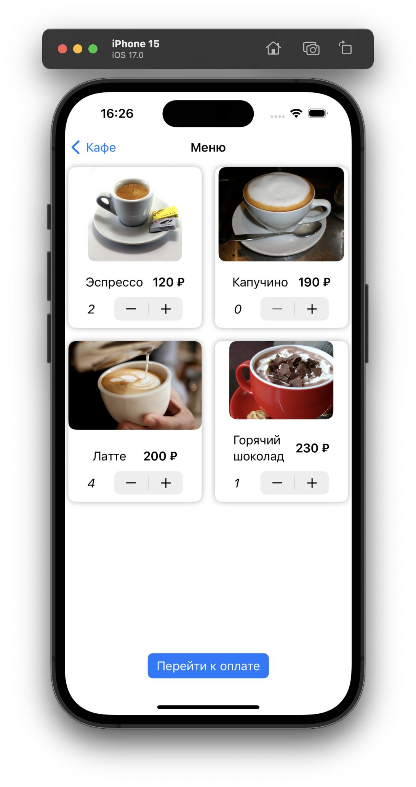
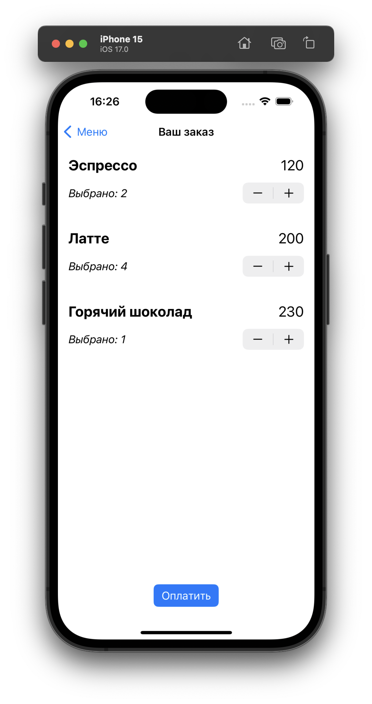
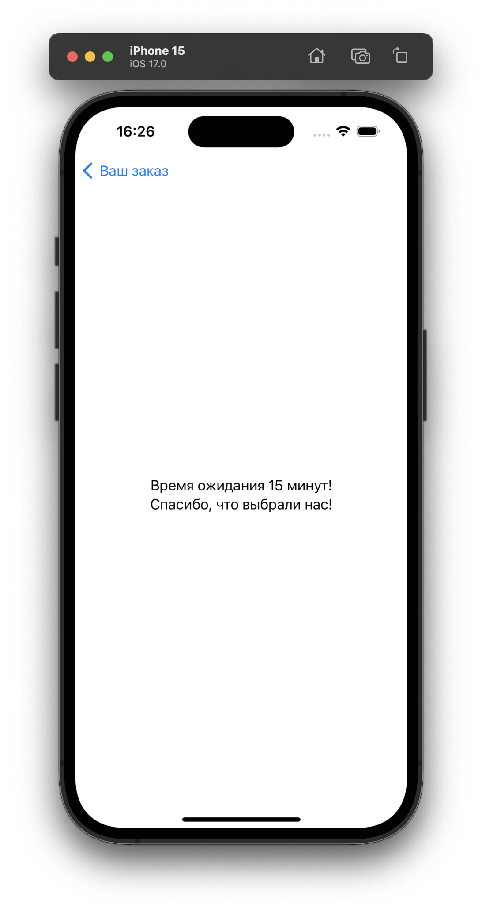

# Тестовое задание для Seven Winds Studio

    

Токен хранится n-ое время и при входе в приложение проверяется его TTL (time-to-live).

  
  
  
  
  
  

## Технологии и инструменты

- [SwiftUI](https://developer.apple.com/xcode/swiftui/)
- [Сетевой слой](https://habr.com/ru/articles/443514/)
- [Postman](https://www.postman.com/)
- [SwiftLint](https://github.com/realm/SwiftLint)
